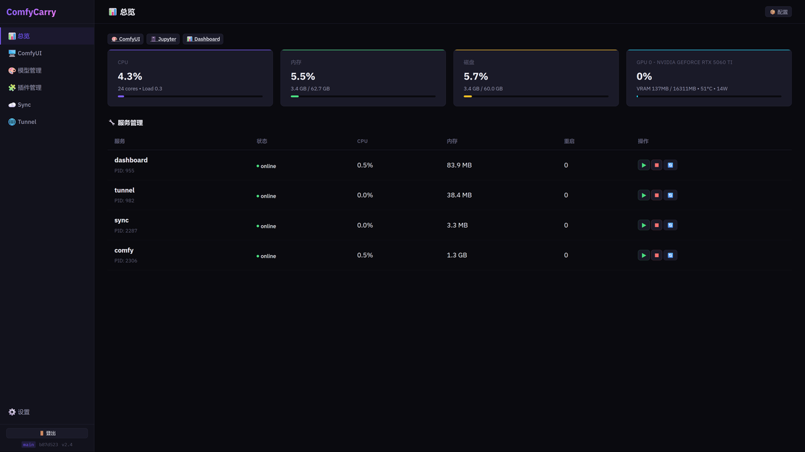
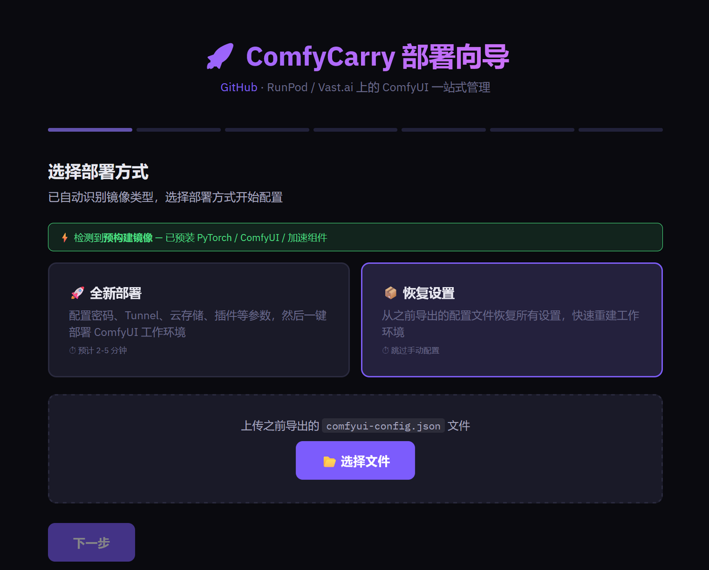
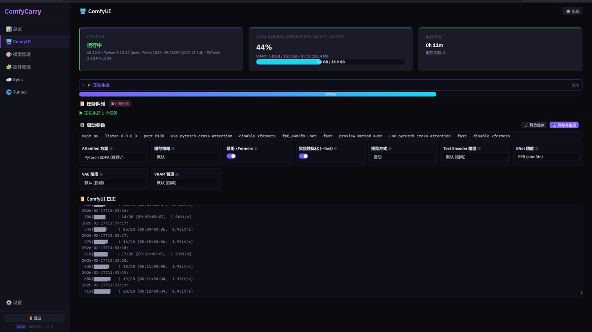
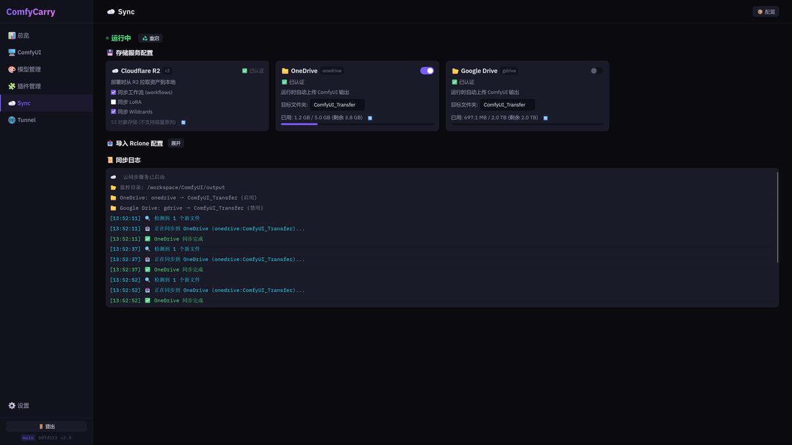
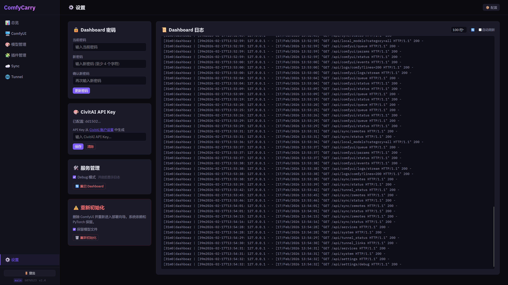

# ComfyCarry

RunPod / Vast.ai 上的 ComfyUI 一站式管理。用完即毁实例 + 配置永续。









---

## 它做什么

Web Dashboard 统一管理 ComfyUI 全生命周期：

- **一键部署** — Setup Wizard 引导配置，自动安装 ComfyUI + 插件 + 依赖
- **系统监控** — CPU / GPU / VRAM / 磁盘实时状态
- **模型管理** — 本地模型浏览 + CivitAI 搜索 + 下载队列
- **插件管理** — 代理 ComfyUI-Manager，浏览/安装/更新/卸载
- **ComfyUI 控制** — 启动参数热改、实时日志、队列/历史、WS→SSE 桥接
- **Cloudflare Tunnel** — 穿透廉价宿主的不稳定公网
- **云同步** — Rclone 管理，工作流/LoRA/输出文件双向同步
- **配置迁移** — 导出/导入全部设置为 JSON，新实例秒级恢复

---

## 快速开始

### 1. 创建实例

在 Vast.ai / RunPod 创建 GPU 实例，选择以下镜像之一：

| 方式 | 镜像 | 耗时 |
|------|------|------|
| **预构建（推荐）** | `ghcr.io/vvb7456/comfyui-runpod:latest` | 2-5 分钟 |
| **完整安装** | `runpod/pytorch:1.0.3-cu1281-torch291-ubuntu2404` | 15-30 分钟 |

预构建镜像含 Python 3.13 + PyTorch 2.9 + CUDA 13 + FlashAttention-3 + SageAttention-3 + ComfyUI + 15 个常用插件。

### 2. 设置启动命令

在 RunPod / Vast.ai 的 **On-start Script** 中填写：

```bash
wget -qO- https://raw.githubusercontent.com/vvb7456/ComfyCarry/main/bootstrap.sh | bash
```

### 3. 访问 Dashboard

打开 `http://<实例IP>:5000`，首次进入 Setup Wizard：

| 步骤 | 配置项 |
|------|--------|
| 部署方式 | 全新部署 / 从 JSON 恢复 |
| 密码 | Dashboard 登录密码 |
| Tunnel | Cloudflare Tunnel Token（可选） |
| 云存储 | Rclone 配置 + 同步偏好（可选） |
| CivitAI | API Key（可选） |
| 插件 | 选择要安装的自定义节点 |
| 确认 | 一键部署，实时日志 |

部署完成自动跳转主界面。

---

## 环境变量

均为可选，Setup Wizard 会自动检测并预填充。

| 变量 | 说明 | 默认 |
|------|------|------|
| `DASHBOARD_PASSWORD` | 登录密码 | `comfy2025` |
| `CF_TUNNEL_TOKEN` | Cloudflare Tunnel Token | — |
| `CIVITAI_TOKEN` | CivitAI API Key | — |
| `RCLONE_CONF_BASE64` | Base64 编码的 rclone.conf | — |
| `COMFYUI_DIR` | ComfyUI 路径 | `/workspace/ComfyUI` |
| `MANAGER_PORT` | Dashboard 端口 | `5000` |

---

## 架构

```
bootstrap.sh              # 入口：装依赖、下文件、启 PM2
workspace_manager.py      # Flask 后端，68 个 API 端点
dashboard.html / .js      # 前端 SPA，原生 HTML/JS/CSS
setup_wizard.html         # 首次部署向导
```

### PM2 进程

| 名称 | 服务 | 端口 |
|------|------|------|
| `dashboard` | Flask 后端 | 5000 |
| `comfy` | ComfyUI | 8188 |
| `tunnel` | Cloudflared | — |
| `sync` | Rclone 同步 | — |

### 运行时文件

| 路径 | 用途 |
|------|------|
| `/workspace/.dashboard_env` | Dashboard 配置 |
| `/workspace/.setup_state.json` | 向导状态 |
| `/workspace/.sync_rules.json` | 同步规则 (v2) |
| `/workspace/.sync_settings.json` | 同步全局设置 |
| `/workspace/.civitai_config.json` | CivitAI Key |

---

## Dashboard 页面

| 页面 | 功能 |
|------|------|
| 总览 | 系统监控、服务状态、Tunnel 快速链接 |
| ComfyUI | 启动参数、实时日志、队列/历史 |
| 模型管理 | 本地模型 + CivitAI 搜索/下载 |
| 插件管理 | 浏览/安装/更新/卸载 |
| Sync | Rclone 配置、远程存储、同步控制 |
| Tunnel | Cloudflare 状态、Ingress 链接 |
| 设置 | 密码、CivitAI Key、Debug、配置导入/导出、重初始化 |

---

## 常用命令

```bash
pm2 ls                    # 查看所有服务
pm2 logs dashboard        # Dashboard 日志
pm2 logs comfy            # ComfyUI 日志
pm2 restart comfy         # 重启 ComfyUI
```

---

## 故障排查

| 问题 | 方向 |
|------|------|
| Dashboard 打不开 | `pm2 logs dashboard` 看报错 |
| ComfyUI 无法启动 | Dashboard → ComfyUI 页查看实时日志 |
| 模型下载失败 | 检查 CivitAI Key 有效性 |
| Tunnel 断连 | Dashboard → Tunnel 页查看状态 |
| 同步不工作 | Dashboard → Sync 页检查 Rclone 配置 |
