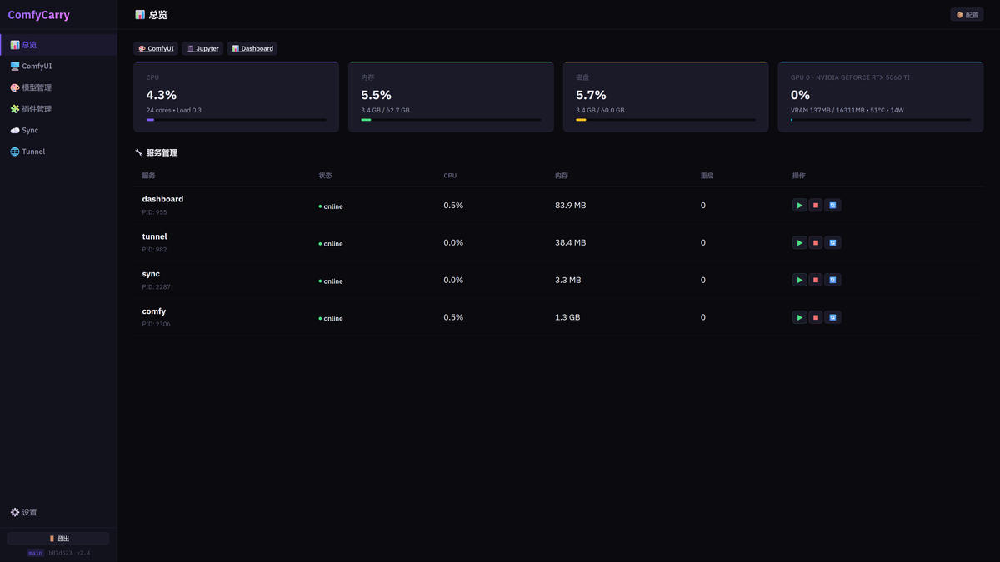
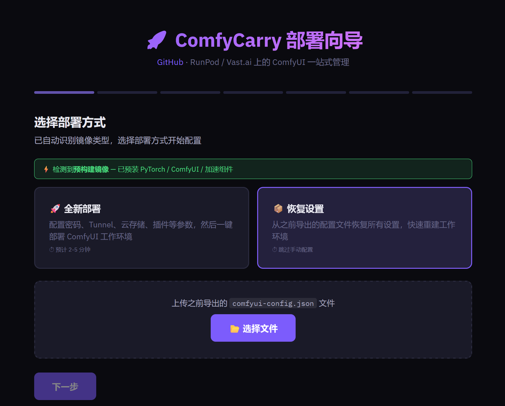
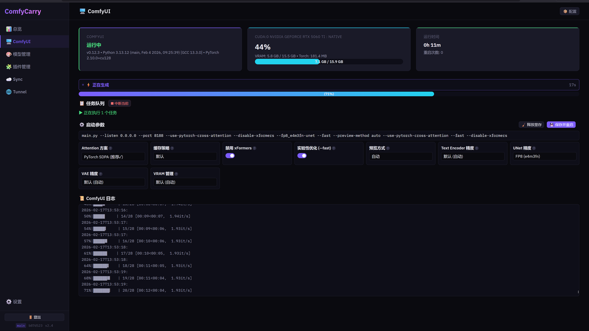
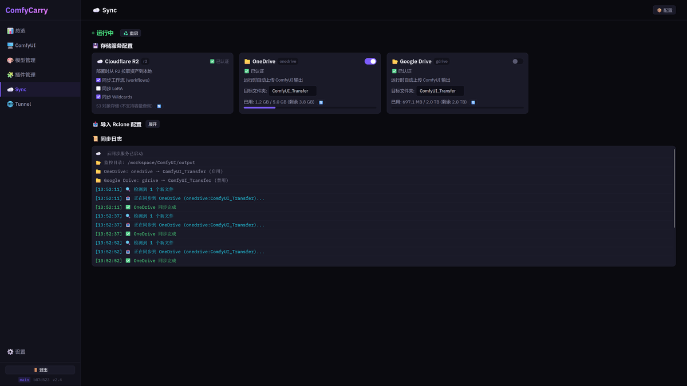
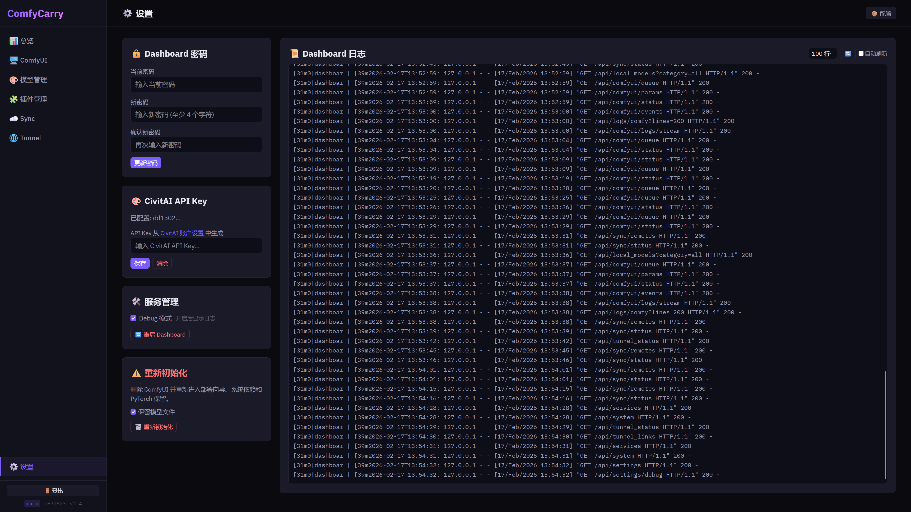

# ComfyCarry

RunPod / Vast.ai 上的 ComfyUI 云端管理平台。用完即毁的实例，永不丢失的配置。









---

## 功能

Web Dashboard 管理 ComfyUI 全生命周期，10 个功能页面：

- **一键部署** — Setup Wizard 引导完成全部配置，自动安装 ComfyUI、插件、依赖
- **系统监控** — CPU / GPU / VRAM / 磁盘实时状态，PM2 服务管理
- **图片生成** — SDXL 文生图，支持 LoRA、ControlNet 三模式、AuraSR 超分、二次采样，工作流自动构建
- **模型管理** — 本地模型浏览 + CivitAI 搜索下载，实时状态刷新
- **插件管理** — 代理 ComfyUI-Manager，浏览/安装/更新/卸载
- **ComfyUI 控制** — 启动参数热改、实时日志流、队列/历史管理
- **Tunnel** — Cloudflare 公共节点 + 自定义 Tunnel 双模式，多服务 DNS 管理
- **云同步** — Rclone 双向同步，规则引擎控制同步策略
- **JupyterLab** — 启动/停止、内核/Session/Terminal 控制
- **SSH** — SSH 服务管理、公钥管理、Root 密码配置
- **配置迁移** — 导出/导入全部设置为 JSON，新实例秒级恢复

---

## 快速开始

### 1. 创建实例

在 Vast.ai / RunPod 创建 GPU 实例，选择预构建镜像：

```
ghcr.io/vvb7456/comfyui-runpod:latest
```

基于 Python 3.12 + PyTorch 2.9.1 + CUDA 13.0，内含 FlashAttention-2、SageAttention-2、ComfyUI 及 21 个常用插件。启动耗时 2-5 分钟。

### 2. 设置启动命令

在 **On-start Script** 中填写：

```bash
wget -qO- https://raw.githubusercontent.com/vvb7456/ComfyCarry/main/bootstrap.sh | bash
```

### 3. 访问 Dashboard

打开 `http://<实例IP>:5000`，首次进入 Setup Wizard：

| 步骤 | 配置项 |
|------|--------|
| 部署方式 | 全新部署 / 从 JSON 恢复 |
| 密码 | Dashboard 登录密码 |
| Tunnel | Cloudflare Tunnel Token |
| 云存储 | Rclone 配置 + 同步偏好 |
| CivitAI | API Key |
| Attention | FlashAttention / SageAttention 选择 |
| 插件 | 选择要安装的自定义节点 |
| 确认 | 一键部署，实时日志 |

部署完成自动跳转主界面。

---

## 预装插件

镜像内置 21 个插件：

ComfyUI-Manager, comfyui_controlnet_aux, ComfyUI-Impact-Pack, ComfyUI-Easy-Use, ComfyUI-Crystools, ComfyUI_UltimateSDUpscale, comfyui-dynamicprompts, WeiLin-Comfyui-Tools, AuraSR-ComfyUI, was-node-suite-comfyui, ComfyUI-KJNodes, Enhanced-Civicomfy, ComfyUI-WD14-Tagger, rgthree-comfy, ComfyUI-Inspire-Pack, ComfyUI-Custom-Scripts, ComfyUI-GGUF, ComfyUI_IPAdapter_plus, ComfyUI-VideoHelperSuite, ComfyUI_essentials, ComfyUI-RMBG

---

## 环境变量

均为可选，Setup Wizard 会自动检测并预填充。

| 变量 | 说明 | 默认 |
|------|------|------|
| `DASHBOARD_PASSWORD` | 登录密码 | `comfy2025` |
| `CF_API_TOKEN` | Cloudflare API Token，用于自动创建 Tunnel | — |
| `CF_DOMAIN` | Cloudflare 托管域名 | — |
| `CF_SUBDOMAIN` | Tunnel 子域名前缀 | — |
| `CIVITAI_TOKEN` | CivitAI API Key | — |
| `RCLONE_CONF_BASE64` | Base64 编码的 rclone.conf | — |
| `COMFYUI_DIR` | ComfyUI 路径 | `/workspace/ComfyUI` |
| `COMFYUI_URL` | ComfyUI 内部 URL | `http://localhost:8188` |
| `MANAGER_PORT` | Dashboard 端口 | `5000` |
| `FORCE_UPDATE` | 强制重新下载 Dashboard 文件 | `false` |
| `SSH_PUBLIC_KEY` | SSH 公钥 | — |

---

## 架构

```
comfycarry/                       # Flask 后端
├── app.py                        # App 工厂 + 启动逻辑
├── config.py                     # 全局配置
├── auth.py                       # 认证中间件
├── routes/                       # 14 个路由蓝图
│   ├── system / comfyui / models / plugins / tunnel
│   ├── sync / jupyter / settings / setup / ssh
│   ├── generate / downloads / frontend
└── services/                     # 业务服务
    ├── comfyui_bridge.py         # WS→SSE 桥接
    ├── deploy_engine.py          # 部署引擎
    ├── sync_engine.py            # 同步引擎
    ├── tunnel_manager.py         # CF Tunnel 管理
    ├── download_engine.py        # 下载队列
    ├── workflow_builder.py       # 工作流构建器
    └── civitai_resolver.py       # CivitAI 模型解析

dashboard.html                    # 前端 SPA
static/js/                        # 前端模块
├── core.js                       # 路由 / Toast / 全局快捷键
├── page-*.js                     # 各页面模块
├── comfyui-progress.js           # 执行状态机 + 进度条
└── sse-log.js                    # SSE 日志流

comfycarry_ws_broadcast/          # ComfyUI 自定义节点 — 实时进度广播
bootstrap.sh                      # 入口脚本
setup_wizard.html                 # 首次部署向导
```

### PM2 进程

| 名称 | 服务 | 端口 |
|------|------|------|
| `dashboard` | Flask 后端 | 5000 |
| `comfy` | ComfyUI | 8188 |
| `cf-tunnel` | Cloudflared | — |
| `jupyter` | JupyterLab | 8888 |

Sync Worker 在 Dashboard 进程内的后台线程运行。

### 运行时文件

| 路径 | 用途 |
|------|------|
| `/workspace/.dashboard_env` | Dashboard 配置 |
| `/workspace/.setup_state.json` | 向导状态 |
| `/workspace/.sync_rules.json` | 同步规则 |
| `/workspace/.sync_settings.json` | 同步全局设置 |
| `/workspace/.civitai_config.json` | CivitAI Key |

---

## 常用命令

```bash
pm2 ls                    # 查看所有服务
pm2 logs dashboard        # Dashboard 日志
pm2 logs comfy            # ComfyUI 日志
pm2 restart comfy         # 重启 ComfyUI
```
