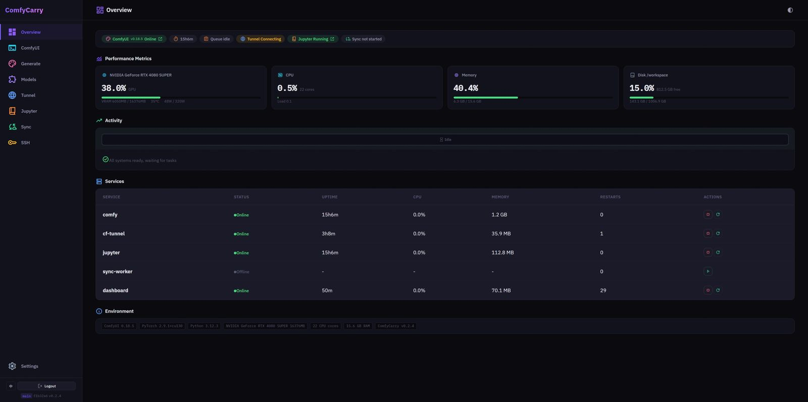
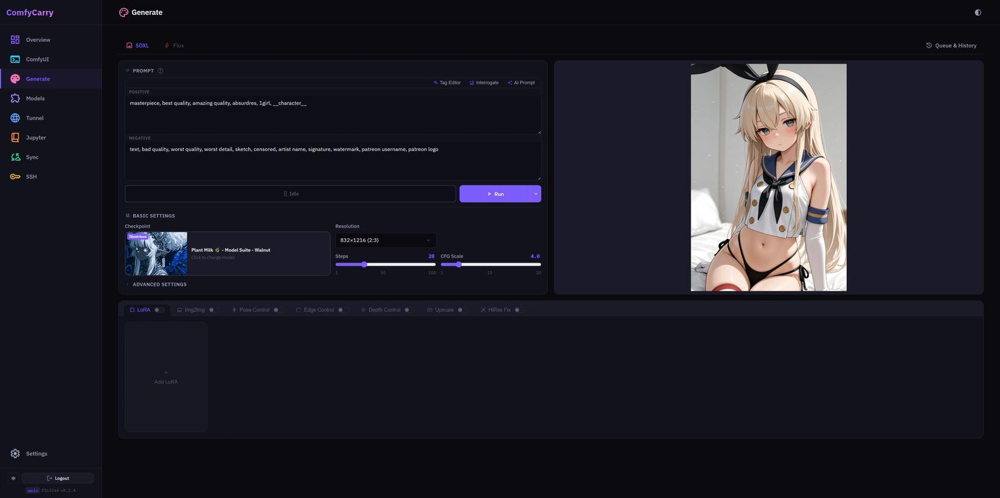
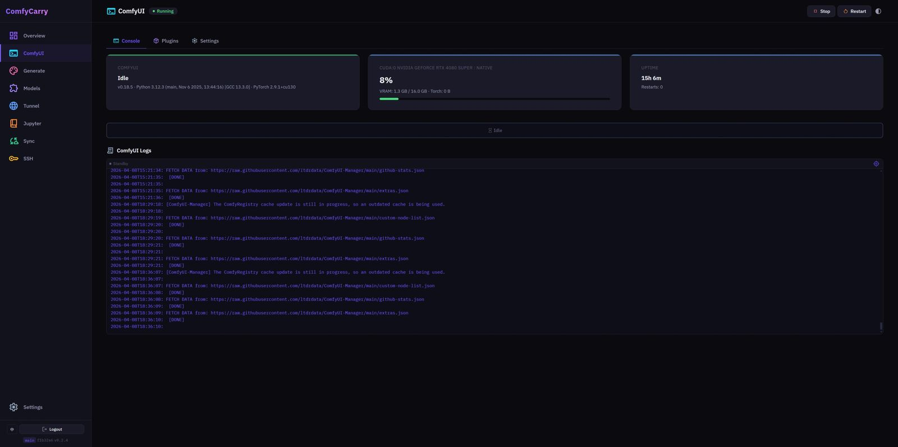
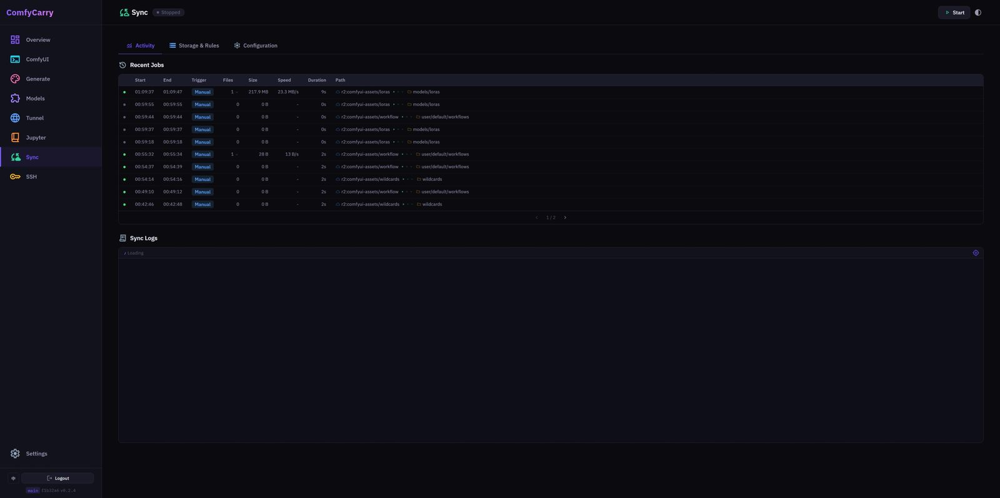

# ComfyCarry

[中文](README_ZH.md) | English

A cloud management platform for ComfyUI on RunPod / Vast.ai. Ephemeral instances, persistent configs.



<p align="center">
  
  
</p>
<p align="center">
  
  
</p>

---

## Features

A web dashboard to manage the full ComfyUI lifecycle:

- **One-Click Deploy** — Setup Wizard guides you through all configuration; auto-installs ComfyUI, plugins, and dependencies
- **System Monitoring** — Real-time GPU / CPU / VRAM / Disk stats, PM2 service management
- **Image Generation** — SDXL / Flux text-to-image with LoRA, ControlNet, Img2Img, upscaling, hi-res fix; automatic workflow building
- **Model Management** — Local model browser + CivitAI search & download, persistent download queue with status tracking
- **Plugin Management** — Proxies ComfyUI-Manager for browsing / installing / updating / uninstalling nodes
- **ComfyUI Control** — Hot-swap launch arguments, real-time log streaming, queue & history management
- **Tunnel** — Cloudflare public endpoint + custom Tunnel dual mode, multi-service DNS management
- **Cloud Sync** — Bidirectional Rclone sync with rule engine, job history & statistics
- **JupyterLab** — Start / stop, kernel / session / terminal control
- **SSH** — SSH service management, public key management, root password config
- **Config Migration** — Export / import all settings as JSON for instant recovery on new instances

---

## Quick Start

### 1. Create an Instance

Create a GPU instance on Vast.ai / RunPod with the pre-built image:

```
erocraft/comfycarry:latest
```

Built on Python 3.12 + PyTorch 2.9.1 + CUDA 13.0, includes FlashAttention-2, SageAttention-2, ComfyUI & 21 popular plugins. Boot time: 2-5 minutes.

### 2. Set the On-Start Script

Paste into the **On-start Script** field:

```bash
wget -qO- https://raw.githubusercontent.com/vvb7456/ComfyCarry/main/bootstrap.sh | bash
```

### 3. Access the Dashboard

Open `http://<instance_ip>:5000`. First visit launches the Setup Wizard:

| Step | Configuration |
|------|---------------|
| Deploy Mode | Fresh deploy / Restore from JSON |
| Password | Dashboard login password |
| Tunnel | Cloudflare Tunnel Token |
| Cloud Storage | Rclone config + sync preferences |
| CivitAI | API Key |
| Attention | FlashAttention / SageAttention selection |
| Plugins | Choose custom nodes to install |
| Confirm | One-click deploy with real-time logs |

Redirects to the main dashboard when deployment completes.

---

## Pre-installed Plugins

The image ships with 21 plugins:

ComfyUI-Manager, comfyui_controlnet_aux, ComfyUI-Impact-Pack, ComfyUI-Easy-Use, ComfyUI-Crystools, ComfyUI_UltimateSDUpscale, comfyui-dynamicprompts, WeiLin-Comfyui-Tools, AuraSR-ComfyUI, was-node-suite-comfyui, ComfyUI-KJNodes, Enhanced-Civicomfy, ComfyUI-WD14-Tagger, rgthree-comfy, ComfyUI-Inspire-Pack, ComfyUI-Custom-Scripts, ComfyUI-GGUF, ComfyUI_IPAdapter_plus, ComfyUI-VideoHelperSuite, ComfyUI_essentials, ComfyUI-RMBG

---

## Environment Variables

All optional. The Setup Wizard auto-detects and pre-fills them.

| Variable | Description | Default |
|----------|-------------|---------|
| `DASHBOARD_PASSWORD` | Login password | `comfy2025` |
| `CF_API_TOKEN` | Cloudflare API Token for auto Tunnel creation | — |
| `CF_DOMAIN` | Cloudflare-managed domain | — |
| `CF_SUBDOMAIN` | Tunnel subdomain prefix | — |
| `CIVITAI_TOKEN` | CivitAI API Key | — |
| `RCLONE_CONF_BASE64` | Base64-encoded rclone.conf | — |
| `COMFYUI_DIR` | ComfyUI path | `/workspace/ComfyUI` |
| `COMFYUI_URL` | ComfyUI internal URL | `http://localhost:8188` |
| `MANAGER_PORT` | Dashboard port | `5000` |
| `FORCE_UPDATE` | Force re-download Dashboard files | `false` |
| `PUBLIC_TUNNEL` | Auto-enable public Tunnel | — |
| `SSH_PUBLIC_KEY` | SSH public key | — |

---

## Architecture

### Backend — Flask

```
comfycarry/
├── app.py                        # App factory + startup
├── config.py                     # Global config
├── auth.py                       # Auth middleware
├── db.py                         # SQLite WAL + auto migrations
├── migrations.py                 # Schema (sync_jobs, download_resources, models)
├── routes/                       # 15 route blueprints
│   ├── system / comfyui / models / plugins / tunnel
│   ├── sync / jupyter / settings / setup / ssh
│   ├── generate / downloads / files / frontend / llm
└── services/
    ├── comfyui_bridge.py         # WS→SSE bridge
    ├── deploy_engine.py          # Deploy engine
    ├── sync_engine.py            # Sync engine + Rclone JSON log parsing
    ├── sync_store.py             # Sync persistence layer
    ├── download_engine.py        # Download queue
    ├── download_store.py         # Download persistence layer
    ├── resource_registry.py      # Model resource registry
    ├── tunnel_manager.py         # CF Tunnel management
    ├── workflow_builder.py       # Workflow builder
    ├── civitai_resolver.py       # CivitAI model resolver
    └── llm_engine.py             # LLM prompt expansion
```

### Frontend — Vue 3 SPA

```
frontend/src/
├── pages/                        # 9 route-level pages (lazy-loaded)
├── components/
│   ├── ui/                       # 36+ reusable base components
│   ├── layout/                   # AppSidebar, PageHeader
│   ├── form/                     # FormField, BaseInput, BaseSelect, etc.
│   ├── models/                   # Model browser components
│   ├── generate/                 # Generate page sub-components
│   ├── sync/                     # Sync Activity components
│   └── wizard/                   # Setup Wizard steps
├── composables/                  # Reusable composition functions
├── stores/                       # Pinia stores (app + generate)
├── i18n/locales/{en,zh-CN}/      # i18n (13 namespaces)
└── css/                          # CSS variable design system (dark/light)
```

Vite 6 + TypeScript 5.9 + Vue 3.5 + Pinia 3 + vue-i18n 11. Build output goes to `static/dist/`, served directly by Flask.

### PM2 Processes

| Name | Service | Port |
|------|---------|------|
| `dashboard` | Flask backend | 5000 |
| `comfy` | ComfyUI | 8188 |
| `cf-tunnel` | Cloudflared | — |
| `jupyter` | JupyterLab | 8888 |

The Sync Worker runs as a background thread inside the Dashboard process.

---

## Common Commands

```bash
pm2 ls                    # List all services
pm2 logs dashboard        # Dashboard logs
pm2 logs comfy            # ComfyUI logs
pm2 restart comfy         # Restart ComfyUI
```
